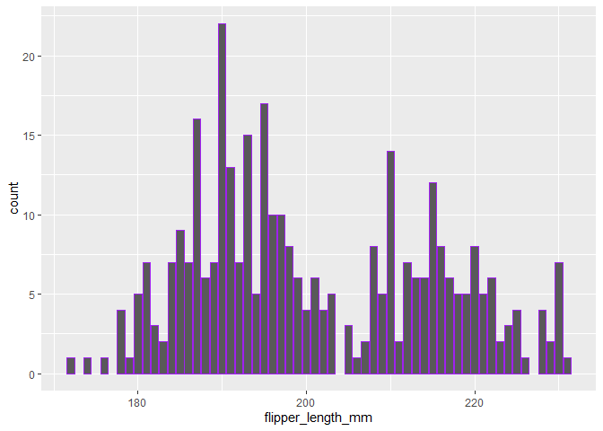

New markdown
================
musabdalash
2023-09-09

``` r
# HI THERE THIS IS THE FIRST TRY
```

``` r
library(tidyverse)
```

    ## ── Attaching core tidyverse packages ───────────────────────────────────────────────────────── tidyverse 2.0.0 ──
    ## ✔ dplyr     1.1.3     ✔ readr     2.1.4
    ## ✔ forcats   1.0.0     ✔ stringr   1.5.0
    ## ✔ ggplot2   3.4.3     ✔ tibble    3.2.1
    ## ✔ lubridate 1.9.2     ✔ tidyr     1.3.0
    ## ✔ purrr     1.0.2     
    ## ── Conflicts ─────────────────────────────────────────────────────────────────────────── tidyverse_conflicts() ──
    ## ✖ dplyr::filter() masks stats::filter()
    ## ✖ dplyr::lag()    masks stats::lag()
    ## ℹ Use the conflicted package (<http://conflicted.r-lib.org/>) to force all conflicts to become errors

``` r
library(palmerpenguins)
```

``` r
ggplot(data = penguins) +
  geom_bar(mapping = aes(x=flipper_length_mm, ), color = "purple")
```

    ## Warning: Removed 2 rows containing non-finite values (`stat_count()`).

<!-- -->
